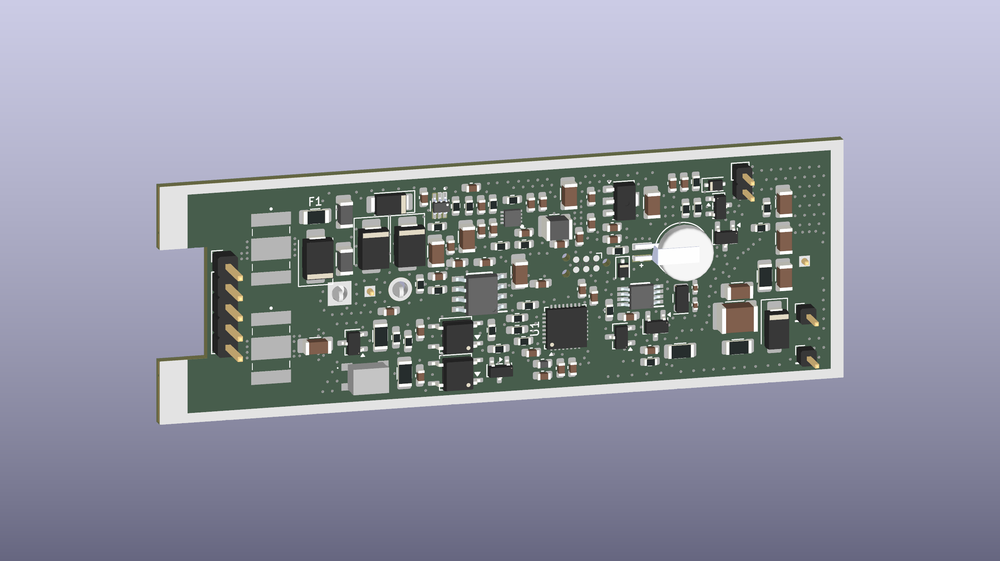
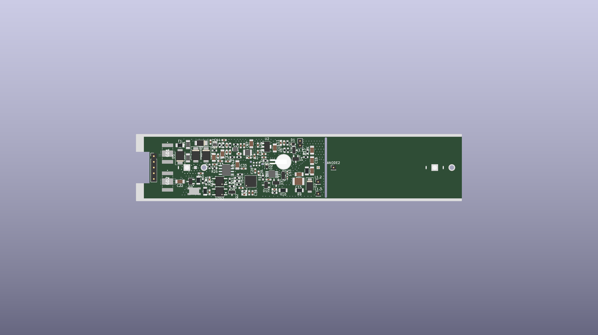
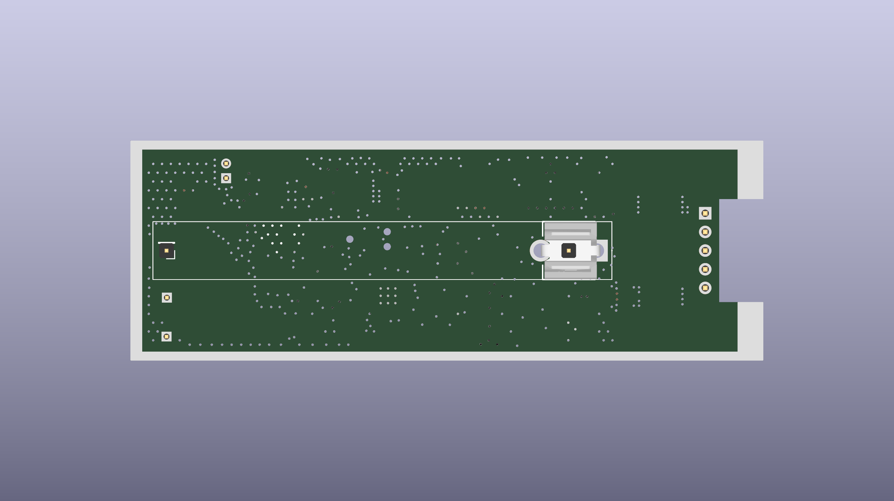

# CanGeigerProbe
## Sonda promieniowania G-M z interfejsem CAN

Polowa sonda promieniowania jonizującego z miniaturową lampą Geigera-Müllera, komunikująca się cyfrowo przez **CAN 2.0B**. Zaprojektowana jako element rozproszonego systemu pomiarowego: wąska sonda cylindryczna w obudowie aluminiowej, jedno złącze M12, micropower, odporność EMC klasy przemysłowej.


> **Status:** schemat (6 arkuszy hierarchicznych) i layout PCB zakończone, pliki produkcyjne wygenerowane — przed zamówieniem prototypu. Firmware na etapie szkieletu bring-up.

Inspiracja: sondy Polon-Alfa (DPO-G, ZR-1) — jedna sonda, cyfrowe wyjście do jednostki nadrzędnej, wymienność lamp.

---

## Płytka

Render 3D aktualnego layoutu (KiCad 10, 4 warstwy, 86 × 29.9 mm, wycięcie pod złącze M12 na lewej krawędzi):



| Góra (TOP) | Dół (BOTTOM) |
|---|---|
|  |  |

Cała elektronika mieści się na jednej stronie; spód pozostaje niemal pusty — rezerwa na strefę HV (widoczny prostokąt creepage z pinami anody i lampy), pole lutownicze wyprowadzeń transformatora oraz uziemienie obudowy. Transformator flybacka jest **off-board** (skręcona para przewodów 4–6 cm).

---

## Najważniejsze cechy

- **Programowalne HV 350–550 V** — jedna sonda obsługuje wiele typów lamp, setpoint ustawiany przez CAN bez zmian sprzętowych.
- **Micropower** — pobór idle rzędu setek µA dzięki buckowi LT8606 (Iq 2.5 µA), MCU w Stop 2 i podwójnemu wybudzaniu (RTC + aktywność magistrali).
- **Flyback sterowany deterministycznie z MCU** — brak dedykowanego kontrolera PWM; TIM2 generuje burst, ADC mierzy HV, firmware zamyka pętlę bang-bang.
- **CAN 2.0B (29-bit ID)** z wybudzaniem na aktywność magistrali, 125 kbit/s – 1 Mbit/s.
- **Przełączalna terminacja CAN** — split 2×59 Ω + 4.7 nF załączany dwoma PhotoMOS-ami z GPIO (sonda na końcu linii vs. w środku, bez zwór).
- **Pomiar własnego poboru prądu** — INA186 A4 (G=200) + shunt 0.5 Ω, rozdzielczość ~2 µA/count; diagnostyka linii i weryfikacja budżetu mocy.
- **Zegar czasu rzeczywistego z podtrzymaniem** — MCP79410 + ogniwo MS621FE; kwarc 32.768 kHz służy też do kalibracji wewnętrznego MSI w STM32.
- **Wymienność lamp** — rezystor gaszący `R12` na PCB dobierany pod konkretną lampę.
- **Odporność EMC** — kaskadowa ochrona coarse→fine (GDT 3-elektrodowe / TVS / CMC / podwójne ferryty), testy IEC 61000-4-2/-4/-5.
- **Obudowa aluminiowa IP67**, złącze M12 5-pin A-coded (standard CANopen CiA 303-1).

---

## Specyfikacja

| Parametr | Wartość |
|----------|---------|
| Detektor bazowy | DOI-80 (~400 V) |
| Zakres HV | 350–550 V, programowalny |
| Wielkości mierzone | CPS/CPM, moc dawki, dawka skumulowana, prąd zasilania, alarmy progowe |
| Interfejs | CAN 2.0B (extended ID), 125k / 250k / 500k / 1 Mbit |
| Zasilanie | 7–32 V DC, wspólna masa (bez izolacji galwanicznej) |
| Pobór idle | ~200 µA @ 12 V |
| Pobór aktywny | ~3.7 mA @ 12 V (chwilowo), do ~20 mA przy TX CAN @ 7 V |
| Ochrona EMC | ESD ±8 kV, Burst ±2 kV, Surge ±2 kV |
| Złącze | M12 5-pin A-coded (1=Vin, 2=GND, 3=CAN_H, 4=CAN_L, 5=Earth) |
| PCB | 4 warstwy, 86 × 29.9 mm, grubość 1.59 mm |
| Obudowa | Aluminiowa cylindryczna Ø wewn. 25 mm, IP67 |

---

## Kompatybilne lampy G-M

Zmiana lampy = zmiana programowa HV + dobór rezystora gaszącego `R12`.

| Lampa | HV nom. | R12 (quench) | Uwaga |
|-------|---------|--------------|-------|
| **DOI-80** | ~400 V | **5.1 MΩ** | domyślna |
| SBM-20 / STS-5 | 400 V | 4.7 MΩ | drop-in z DOI-80 |
| SBM-19 | ~400 V | 5.1 MΩ | |
| J305 / M4011 | ~400 V | 4.7 MΩ | lampy chińskie |
| LND712 | 500 V | 10 MΩ | wymaga wyższego HV |

Rezystor HV w obudowie 1206 (HVC1206) — lutowany wg używanej lampy.

---

## Architektura

```
M12 Vin (7-32V) ─▶ Ochrona (GDT+TVS+ferryt) ─▶ shunt 0.5Ω ─▶ LT8606 buck ─▶ +5V ─┬─▶ ATA6561 (CAN)
                                                    │                              │
                                                 INA186 ─▶ ADC                     ├─▶ MCP1700 LDO ─▶ +3.3V ─▶ STM32L432
                                                                                   │                              │
                                                                                   │                     MCP79410 RTC + BT1
                                                                                   │
                                                                                   └─▶ Flyback (Q1 + T1 P18/11) ─▶ +HV
                                                                                                                    │
   Lampa G-M ◀─ R12 (quench) ◀─ dzielnik HV 1GΩ:1MΩ ◀─────────────────────────────────────────────────────────────┘
        │
        └─▶ dzielnik pojemnościowy ─▶ COMP1 (próg z DAC1) ─▶ LPTIM (zliczanie w Stop 2)
```

Kluczowa cecha: **wspólna masa** (star ground), izolacja zapewniona wyłącznie przez TVS/GDT; `Earth` (obudowa) oddzielona od `GND` sygnałowej i łączona tylko przez Y-cap 1 nF/2 kV. Flyback „śpi" i budzi się kilka razy na sekundę — stąd pobór na poziomie µA.

### Arkusze schematu

| Arkusz | Plik | Zawartość |
|--------|------|-----------|
| root | [geiger_probe.kicad_sch](pcb/geiger_probe.kicad_sch) | połączenia hierarchiczne |
| PWR | [pwr.kicad_sch](pcb/pwr.kicad_sch) | buck LT8606, LDO MCP1700, INA186, dzielnik VIN_SENSE |
| MCU | [mcu.kicad_sch](pcb/mcu.kicad_sch) | STM32L432, RTC MCP79410, kwarc 32k, SWD (Tag-Connect) |
| HV | [hv.kicad_sch](pcb/hv.kicad_sch) | flyback (trafo, Q1, snubber RCD), dzielnik HV, detektor GM + shaper |
| CAN_BUS | [can_bus.kicad_sch](pcb/can_bus.kicad_sch) | ATA6561, terminacja PhotoMOS |
| PROTECTION | [prot.kicad_sch](pcb/prot.kicad_sch) | ochrona Vin i CAN, złącze M12 |

Wyrenderowane PDF-y: [schemat](prod/sch/geiger_probe.pdf) · [PCB](prod/pcb/geiger_probe.pdf) · [interaktywny BOM](prod/ibom/geiger_probe_ibom.html).

---

## Kluczowe komponenty

| Blok | Element | Uwaga |
|------|---------|-------|
| Buck | LT8606IDC#TRPBF | DFN-8, Iq 2.5 µA (zawsze Burst Mode), Vref FB 0.778 V — jedyny element spoza TME |
| LDO 3.3 V | MCP1700-3302E/MB | SOT-89, Iq 1.6 µA |
| Current sense | INA186A4IDCKR + 0.5 Ω | 40 V CM, G=200, pin EN — pomiar poboru sondy |
| MCU | STM32L432KCU6 | bxCAN, LPTIM, COMP1, TIM2, ADC, DAC1 |
| RTC | MCP79410-I/MS + MS621FE-FL11E | RTC/EEPROM I2C z podtrzymaniem, kwarc 32.768 kHz |
| CAN | ATA6561-GAQW-N | zamiennik TJA1042 dostępny w TME |
| Terminacja CAN | 2× GAQY212GS + 2× 59 Ω + 4.7 nF | split przełączalny, sterowany BSS138 |
| Transformator | własny P18/11-3F3, 17:510 | nawijany ręcznie, off-board |
| Klucz flyback | DMN3404L | 30 V, snubber RCD (BAV21WS) clamp do +5 V |
| Dioda HV | STTH112A | 1200 V |
| Dzielnik HV | 2× HVC1206 500 MΩ | /1001, ochrona ADC diodami BAV199 |
| Ochrona Vin | 3R090-5S (GDT) + SMBJ33CA + PMEG6030EP + 2× SMBJ36A | kaskada coarse→fine, podwójny ferryt BLM31 |
| Ochrona CAN | 3R090-5S + CDSOT23-T24CAN + ACT45B-510 | GDT, dedykowany TVS, CMC |

Pełna lista: [prod/bom/](prod/bom/) (generowana z KiCad, nietrackowana w git). Szacunkowy koszt kompletu: **~160–200 zł**.

---

## Transformator (DIY)

Najbardziej „ręczna" część projektu — rdzeń kubełkowy **P18/11-3F3**, mocowany śrubą **M2 A2 (nierdzewna, niemagnetyczna!)** z podkładkami nylonowymi chroniącymi kruchy ferryt.

- Pierwotne: **17 zw** drut 0.30 mm CuL
- Wtórne: **510 zw** drut 0.10 mm CuL (przekładnia 1:30)
- Szczelina: Kapton 100 µm między połówkami
- Parametry docelowe: Lp ≈ 75 µH, Ls ≈ 67 mH, leakage < 1.5 µH, izolacja P/S > 1 GΩ

Zasilany z **+5 V** (nie z Vin), snubber RCD clamp do +5 V — recykling energii rozproszenia, Vds ~20 V, cichy EMC. Procedura nawijania, obliczenia i testy (hi-pot 1 kV/60 s) — patrz dokumentacja projektowa.

---

## Firmware

Projekt STM32CubeIDE w [firmware/CanGeigerProbe/](firmware/CanGeigerProbe/) — na razie szkielet wygenerowany z CubeMX ([CanGeigerProbe.ioc](firmware/CanGeigerProbe/CanGeigerProbe.ioc)) z inicjalizacją ADC1, CAN1, COMP1, DAC1, I2C1 i TIM2. Logika aplikacji (pętla HV, zliczanie w Stop 2, protokół CAN) do napisania.

---

## Roadmap

- [x] **Faza 1** — projekt: topologia, dobór komponentów, obliczenia, EMC, budżet mocy
- [ ] **Faza 2** — prototyp transformatora (nawinięcie, strojenie, testy)
- [x] **Faza 3** — schemat i layout PCB w KiCad (strefy HV / analog / cyfrowe), pliki produkcyjne wygenerowane
- [ ] **Faza 3b** — zamówienie PCB, montaż sekcyjny, bring-up sprzętowy
- [ ] **Faza 4** — firmware (LPTIM+COMP w Stop 2, pętla HV, bxCAN + wake-up, RTC/kalibracja MSI, current-sense, protokół)
- [ ] **Faza 5** — kalibracja HV per lampa, kalibracja CPS→µSv/h (Cs-137), testy EMC
- [ ] **Faza 6** — mechanika: obudowa Al, montaż M12, testy IP67

---

## Struktura repozytorium

```
.
├── media/          # rendery 3D płytki
├── pcb/            # projekt KiCad 10 (schemat hierarchiczny, PCB, biblioteki lokalne, modele 3D)
├── prod/           # pliki produkcyjne: gerbery (.zip), PDF schematu i PCB, interaktywny BOM
├── sim/            # symulacje LTspice (flyback HV, LT8606)
└── firmware/       # projekt STM32CubeIDE (STM32L432, szkielet bring-up)
```

Pliki produkcyjne generowane są jobsetami KiCad: [gen_prod.kicad_jobset](pcb/gen_prod.kicad_jobset) (PDF + BOM), [gen_gerber.kicad_jobset](pcb/gen_gerber.kicad_jobset) (gerbery + wiertła), [gen_media.kicad_jobset](pcb/gen_media.kicad_jobset) (rendery 3D).

---

## Referencje

- Analog Devices **CN-0536** — Geiger Counter Circuit (odczyt z anody, dzielnik pojemnościowy, komparator)
- STM32L432: RM0394, DS11453; bxCAN: AN2606, AN5028
- LT8606 (Analog Devices), MCP1700 / MCP79410 / ATA6561 (Microchip), INA186 (TI)
- Ferroxcube P18/11, materiał 3F3; EPCOS/TDK B65651/B65652
- IEC 61000-4-2/-4/-5; EN 61326-1; EN 61000-6-2
- CAN 2.0B: ISO 11898-1/-2; CANopen CiA 301, CiA 303-1; M12: IEC 61076-2-101
- Polski podręcznik metrologii promieniowania — układy pracy liczników DOI/BOI/GOI

---

## Licencja

MIT

---

> ⚠️ **Uwaga bezpieczeństwa:** urządzenie generuje napięcie ~350–550 V. Zachowaj ostrożność przy uruchamianiu i pomiarach obwodów HV.
